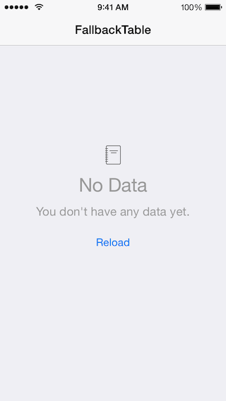

# FallbackTable
Subclass of UITableViewController for showing empty data sets when there is no content to display.



###How do I use this?

1. Drag-and-drop the "FallbackTable" folder into your Xcode project. I suggest you check the box for "Copy items if needed", select "Create groups", and check the box to add it to your target.
2. Create a subclass of `FallbackTableViewController` or take an existing subclass of `UITableViewController` and change it to a subclass of `FallbackTableViewController` instead.
3. Whenever you call `[self.tableView reloadData]`, immediately call `[self checkForEmptyDataSet]`.
4. Implement the `configureFallbackView` method to configure the "fallback view" that is shown when the tableView is empty. Here is an example:

```objc
- (void)configureFallbackView {
    
    self.fallbackView.titleLabel.text = @"No Data";
    self.fallbackView.detailLabel.text = @"You don't have any data yet.";
    self.fallbackView.imageView.backgroundColor = [UIColor darkGrayColor];
    [self.fallbackView.button setTitle:@"Reload" forState:UIControlStateNormal];
    [self.fallbackView.button addTarget:self action:@selector(fallbackButtonTapped) forControlEvents:UIControlEventTouchUpInside];
}
```

### License

The MIT License (MIT)
